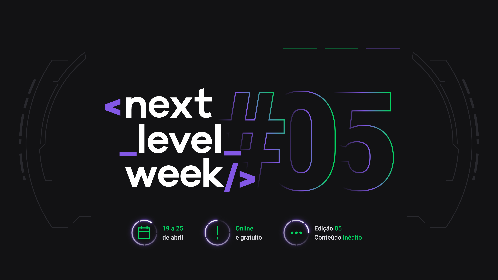

</img>
<h1 align="center">NextLevelWeek 5</h1>
<p align="center">Projeto <strong>Inmana</strong> desenvolvido durante a NLW 5 da Rocketseat</p>

<p align="center">
  <a aria-label="Versão do Node" href="https://github.com/nodejs/node/blob/master/doc/changelogs/CHANGELOG_V12.md#12.14.1">
    </img>
  </a>
  <a aria-label="Completo" href="https://nextlevelweek.com/episodios/elixir/1/edicao/5">
    </img>
  </a>
</p>

## 🚀 Setup
Instale a versão mais recente do Elixir, Phoenix e PostgreSQL no seu computador utilizando essas [configurações de ambiente](https://www.notion.so/Configura-es-do-ambiente-9d73d4eefa7043f593d9c768922306ca).  
Para instalar as dependências do projeto e iniciá-lo, execute:

```bash
mix deps.get # Instalar deps
mix ecto.create # Criar o database do Inmana
mix phx.server # Executar o backend em localhost:4000
```

Existem também outros comandos CLI para desenvolvimento e testes:
```bash
mix format # Corrigir formatação do código
mix compile # Compilar o projeto para ./_build
mix test # Rodar os testes automatizados
mix credo.gen.config # Gerar configurações do linter (credo)
iex -S mix # Testar alguma funcionalidade/modulo separado diretamente pelo iex
```
Assim que terminar, abra em seu navegador a página `localhost:4000` para acessar as rotas da aplicação.

## 📜 Licença

[MIT](./LICENSE) &copy; [Rocketseat](https://rocketseat.com.br/)
